# Azure Vision Studio

Ao abrir o Azure Vision Studio no link https://portal.vision.cognitive.azure.com/ somos apresentados à tela de boas vindas com os modelos prontos para serem testados.

| Portal Vision Studio                            | 
| ----------------------------------- |
| 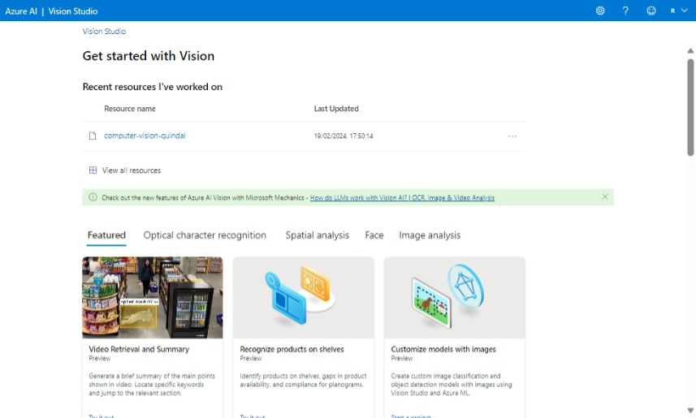 |

Rodei uma série de testes com os modelos disponíveis no Vision Studio e os resultados são bem impressionantes, mas, ainda há dificuldade em detetar poster de animação com fotografia de um humano ou desenho animado.
Levanta algumas questões preocupantes de segurança se você for usar algum desses modelos em produção, mas dá para brincar :)

Além do mais, você pode treinar um modelo novo, ou customizar os modelos já existentes, para saber mais https://learn.microsoft.com/en-us/azure/ai-services/computer-vision/how-to/model-customization?tabs=studio.

## Banco de Imagens de Entrada
Descrição breve das imagens usadas nos testes. 

Todas as imagens estão disponíveis na pasta [`inputs`](https://github.com/quindai/mlai9002/tree/main/inputs). 
| avengers-ca.jpg  | randy-qquant.jpeg (me)  | avengers.jpg  |  mib.jpg  |  bob-marley.jpg  | 
| ----------------------------------- | ----------------------------------- | ----------------------------------- | ----------------------------------- | ----------------------------------- |
| 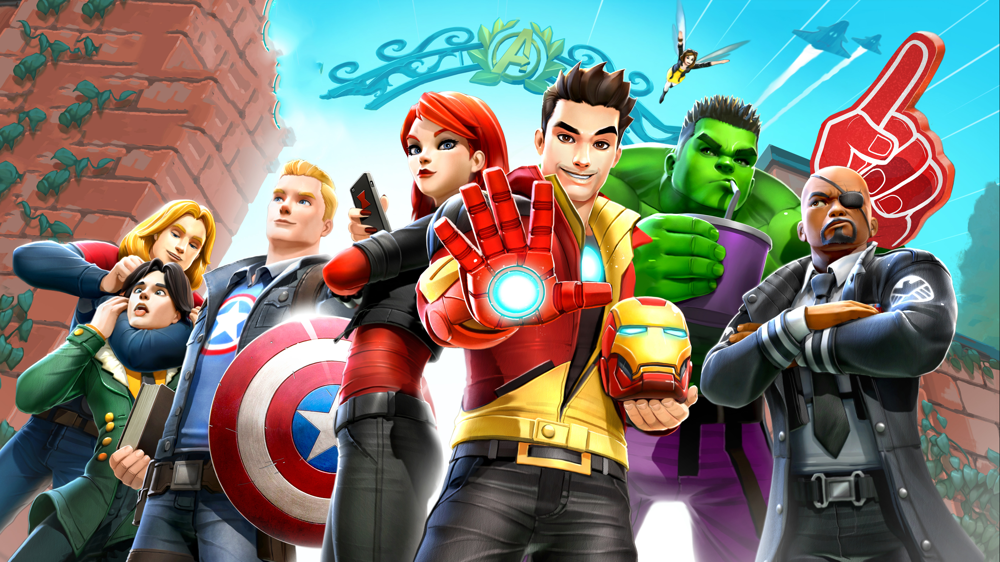 |  | 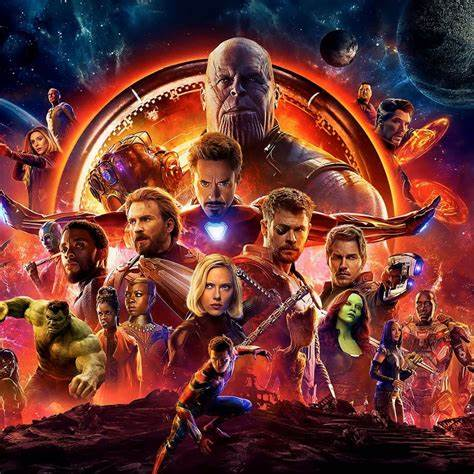 | 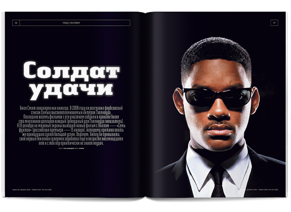 | 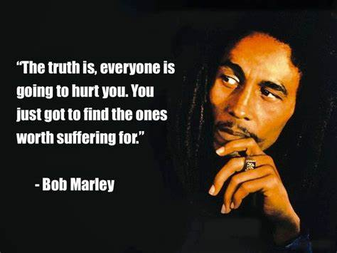 |

## Resultados Obtidos no Vision Studio
### Imagem `avengers-ca`
Observe os serviços de `Add captions to images` e `Add dense captions to images` para descrição das imagens. O modelo identifica a imagem como fotografia de pessoas reais, bastante hilário. Mas isso pode ser facilmente explicado, porque o modelo identifica o rosto através de coordenadas descritas como pontos de referência facial, veja mais detalhes em https://learn.microsoft.com/pt-br/azure/ai-services/computer-vision/concept-face-detection.

| Add captions to images  | Add dense captions to images 1 | Add dense captions to images 2  | 
| ----------------------------------- | ----------------------------------- | ----------------------------------- |
| 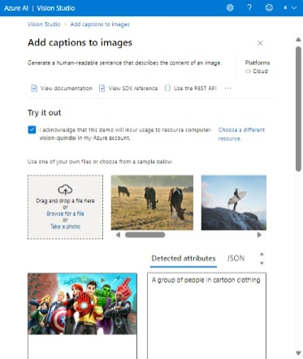 | 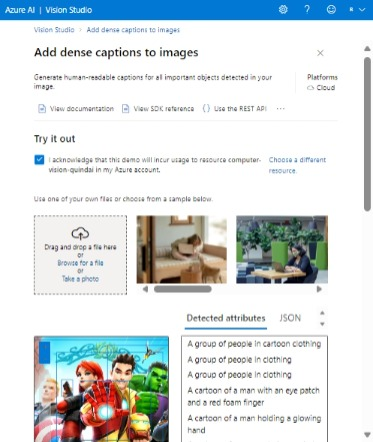 | 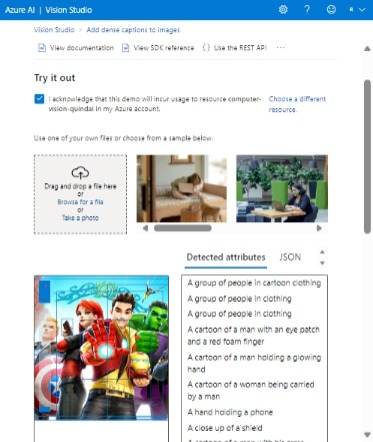 | 

### Imagem randy-qquant
Rodei os serviços `Extract common tags from images` e `Add dense captions to images` no print de uma matéria que fizeram sobre a minha startup. Uma imagem contendo texto em formato de post de instagram.
O objetivo aqui era avaliar a capacidade do serviço em sugerir uma descrição para a postagem tendo como input uma imagem. Talvez o uso para copywrite não seja a forma ideal de usar essa tecnologia, mas possui grande potencial como melhoria na acessibilidade em sites na descrição de imagens, é impressionante.
| Extract common tags from images  | Add dense captions to images 1 |
| ----------------------------------- | ----------------------------------- | 
| 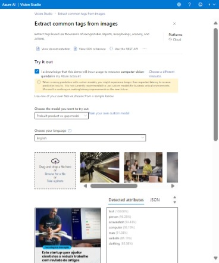 | 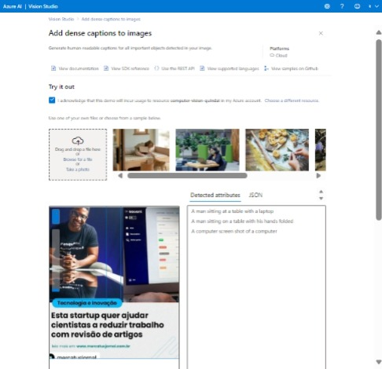 |

### Imagem avengers
Esse resultado foi agradavelmente surpreendente, porque o serviço identificou claramente que era um poster de filme. O Thanos não foi identificado como face humana, curioso :dizzy_face:, já que o modelo identificou o `avengers-ca` como faces humanas :eyes:.
| Add dense captions to images |
| ----------------------------------- | 
| 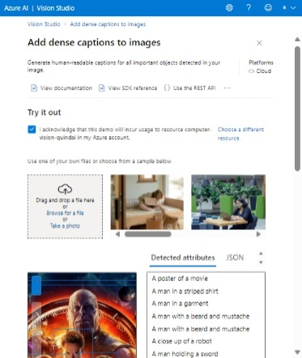 | 

### mib
| Add captions to images  | Detect faces in an image |
| ----------------------------------- | ----------------------------------- | 
| 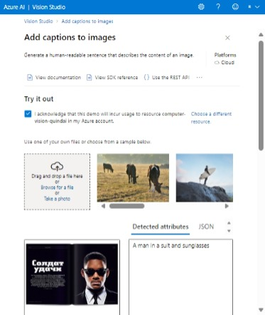 | 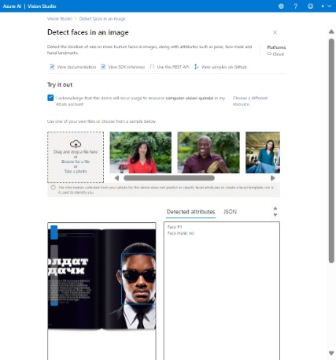 |

### bob-marley
| Extract text from images  | Detect faces in an image |
| ----------------------------------- | ----------------------------------- | 
| 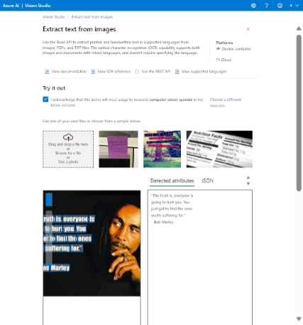 | 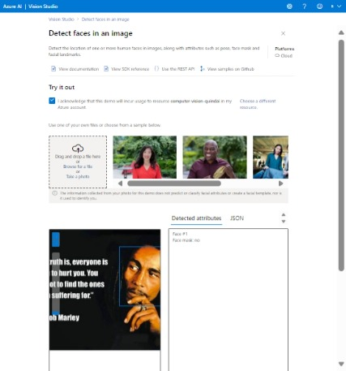 |

